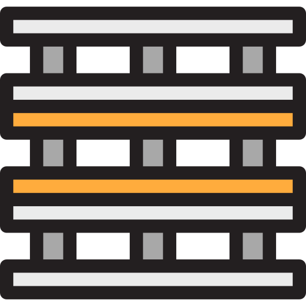

  

pallet
===

Pallet is a Stackdriver logging helper with request context grouping of messages.

## Usage
For more details, see `examples/`.

    // Example chi router
    r := chi.NewRouter()
    
    // Create new option sets
    loggingOptions := pallet.NewOptionSet()
    loggingOptions.SetLabels(map[string]string{
      "test": "test",
    })
    
    // Set the google project
    loggingOptions.SetProject(os.Getenv("GOOGLE_CLOUD_PROJECT"))

    // Pass options to the middleware
    r.Use(pallet.DefaultMiddleware(loggingOptions))

This middleware will create a `Logger` and pass it via the `r.Context()`. 
You can access it within your request handler with the following:
  
    logger := pallet.GetLoggerFromRequest(r)
    logger.Logf(logging.Warning, "url: %+v", r.URL.Path)

## Reference Materials:
The following packages, posts and projects have influenced this project:

 - https://medium.com/google-cloud/combining-correlated-log-lines-in-google-stackdriver-dd23284aeb29
 - https://github.com/andyfusniak/stackdriver-gae-logrus-plugin
 - https://medium.com/google-cloud/using-stackdriver-with-golang-on-istio-2ccbe00bbcd8
 - Logo from https://www.svgrepo.com/svg/234344/pallet 
 - https://github.com/mtraver/gaelog/blob/master/gaelog.go
